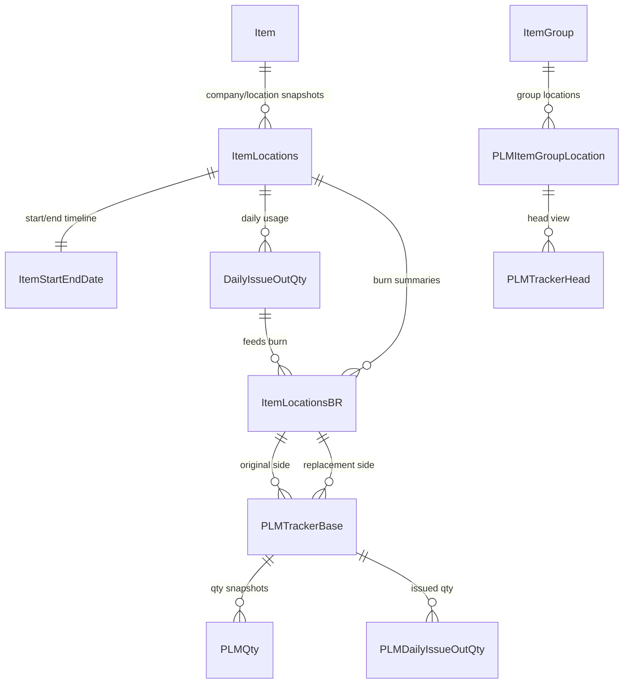
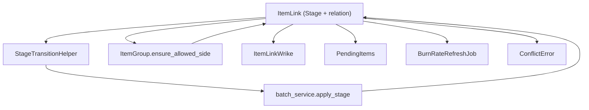

# PLM Tracker - Overall Design

## Purpose & Scope
- Equip the Supply Chain / Procurement team with a workflow-first tracker for item lifecycle conversions, replacements, and go-live execution.
- Centralize inventory, replacement metadata, Wrike IDs, burn-rate refreshes, conflicts, and supporting documents inside a single SQL-backed system.
- Provide self-serve analytics (dashboards, exports, requesters modal, graph views) so analysts can plan conversions and communicate status quickly.

### Scope Boundaries
- **Included**: Items slated for inventory space that already exist on an MHS contract and are actively undergoing a conversion effort. Tracker calculations only cover conversion pairs that are 1-1, many-1, or 1-many; reciprocal, chained, or many-to-many scenarios must be resolved by Materials Management and Sourcing before the items are added and tracked.
- **Current coverage**: The present release only tracks items belonging to company 3000 with MHS contracts.

#### Out-of-Scope Today
1. Non-conversion additions (pure new item setup for Item Master / Inventory / PAR). Those continue to follow the existing new-item workflow outside PLM Tracker.
2. Expanding coverage to additional companies. This is treated as a scope change and may be considered in future development.
3. Tracking non-inventory items. That would constitute a new business requirement and will be evaluated in a separate workstream.

## Capabilities Snapshot
- Collector workspace for batch item-link creation, Excel uploads, conflict review, group maintenance, stage updates, Wrike/go-live edits, and burn-rate job monitoring.
- Dashboard combining PLM tracker rows with inventory & PAR data: interactive filters, tri-state toggles, requesters modal, charts, and Excel exports.
- Playground graph that visualizes item-to-replacement networks with D3, optional inventory quantity overlays, and advanced filters for exploratory analysis.
- Authentication plus lightweight admin tooling: local accounts, Microsoft Graph password resets, and role management (``admin``, ``user``, ``view-only``).
- Background burn-rate refresh pipeline that hydrates SQL Server stored procedures to keep downstream inventory recommendations current.

## Architecture Overview
- Flask application factory (``app/__init__.py``) wires SQLAlchemy, Flask-Login, and blueprints; Waitress (``run.py``) or IIS FastCGI (``run_fastcgi.py``) host the app.
- Domain helpers in ``app/utility`` encapsulate grouping, conflict detection, burn-rate scheduling, exports, and Microsoft Graph calls.
- SQLAlchemy metadata is bound to the ``PLM`` schema; ORM models map both tables (ItemLink, ConflictError, BurnRateRefreshJob) and read-only views (inventory, dashboard feeds).
- Background work stays in-process via a shared ``ThreadPoolExecutor`` (2 workers) that calls PLM stored procedures over pyodbc connections.
- External dependencies: SQL Server (all PLM data), Microsoft Graph (email), OpenPyXL (Excel ingestion/export), and D3 (playground visualization).

```
Clients (browser)
    |
Flask blueprints (auth, collector, dashboard, playground, admin, main)
    |
Domain helpers (stage transitions, grouping, exports, burn-rate scheduler)
    |
SQLAlchemy ORM session ---------------> SQL Server (PLM schema & views)
    |                                      |
    |                                      +--> Stored procedures (burn-rate rollups)
    +--> ThreadPool burn-rate worker
    +--> Microsoft Graph (password reset email)
```

## Data Model Relationships
The tracker leans on PLM-provided views for inventory/burn insights and on writeable ItemLink tables for workflow state. The diagram below highlights the canonical paths from inventory facts into tracker-facing views.



## ItemLink: Relationship & Stage Control
- **Canonical edge**: `ItemLink` is the single writeable relation between Original and Replacement items; filtered unique indexes ensure each `(item_group, item)` has at most one active replacement plus a discontinued/null row (`app/models/relations.py`).
- **Stage guardianship**: `StageTransitionHelper.evaluate_transition` is invoked before every mutation, so invalid stage jumps are blocked with clear reasons (`app/utility/stage_transition.py`, `app/collector/batch_service.py`).
- **Side integrity**: `ItemGroup.ensure_allowed_side` prevents an item from occupying both sides of a group even when other validation passes (`app/models/relations.py`).
- **Operational fan-out**: Wrike tasks, pending placeholders, burn-rate jobs, and conflict logs all cascade from `ItemLink.pkid`, keeping downstream tables synchronized with lifecycle events.



## Request Lifecycle
1. ``run.py`` (or ``run_fastcgi.py``) instantiates the app via ``create_app``, loading environment-specific config and registering blueprints.
2. Flask-Login enforces authentication; unauthenticated users are redirected to ``/auth/login`` and the admin blueprint double-checks roles.
3. Request handlers (``collector/routes.py``, ``dashboard/routes.py``, etc.) compose ORM queries, domain helpers, and validators before mutating the database.
4. Responses are mostly server-rendered Jinja templates; some routes emit JSON (dashboards, batch APIs) or generated Excel workbooks via OpenPyXL.
5. Collector actions that affect burn-rate calculations enqueue jobs through ``schedule_burn_rate_refresh``, which the background thread picks up after the request returns.
6. SQLAlchemy sessions are committed per request; helper modules such as ``ItemLinkWrike.ensure_for_link`` keep related tables in sync before the transaction closes.

## Blueprint Responsibilities

### Entry points & configuration
- ``run.py`` selects Waitress in production (port 8090) and can prepend ``URL_PREFIX``; in development it prints the URL map and runs Flask's reloader.
- ``run_fastcgi.py`` mirrors the same factory for IIS deployments.
- ``app/__init__.py`` configures SQLAlchemy with schema-qualified metadata and calls ``db.create_all()`` (useful for dev/test); ``login_manager.user_loader`` resolves ``User`` ids.
- ``app/config.py`` loads ``.env`` defaults via ``python-dotenv`` and exposes options such as ``MAX_BATCH_PER_SIDE``, ``ENABLE_BURN_RATE_REFRESH``, ``INCLUDE_OR_INVENTORY_LOCATIONS``, Graph credentials, and an optional SQLite override (``USE_SQLITE=1``).

### Authentication & user admin
- ``auth/routes.py`` provides registration, login, logout (POST), and password reset flows. Reset codes are stored with expirations on ``User`` records and are emailed via Microsoft Graph (``utility/msgraph.py``).
- ``app/models/auth.py`` stores hashed passwords, roles, last login timestamps, and temporary reset codes.
- ``admin/routes.py`` offers ``/admin/user-control`` for role updates and deletions, guarded so non-admins cannot demote others or delete themselves.

### Collector workflow (``collector/routes.py``)
- ``/collect`` renders the primary batch worksheet, stage dropdowns, go-live calendar limits, and configuration such as ``MAX_BATCH_PER_SIDE``.
- ``/groups`` lists grouped ItemLink rows (with Wrike metadata), exposes stage transitions per StageTransitionHelper, and links to batch actions.
- ``/conflicts`` surfaces rows from ``PLM.ConflictError`` with filtering, single delete, and purge-before-date actions for long-lived noise.
- ``/groups/clear-deleted`` migrates rows marked ``Deleted`` into ``ItemLinkDeleted`` history before removal.
- Batch APIs (``/api/item-links/stage``, ``/api/item-links/wrike``, ``/api/item-links/go-live``) call ``collector/batch_service.py`` to validate rows, apply transitions, and summarize outcomes.
- ``/upload/pairs`` ingests Excel (OpenPyXL ``load_workbook``), enforces sentinel rules (``NO REPLACEMENT``, ``PENDING***``), and delegates to ``utility/add_pairs.py`` for validation, group assignment, conflict detection, persistence, and burn-rate job scheduling.
- ``/api/burn-rate-jobs`` exposes latest statuses from ``BurnRateRefreshJob`` for the UI polling widget.
- ``collector/routes.py`` also hosts JSON helpers for contract lookup tables and Pending item exports that feed partial templates such as ``collector/_contract_item_search_table.html``.

### Dashboard analytics (``dashboard/routes.py``)
- ``/dashboard`` renders the main UI (``dashboard/index.html``) with filters, KPIs, tables, charts, requesters modal, and export actions. Filters auto-apply via JSON APIs.
- APIs include ``/dashboard/api/stats``, ``/dashboard/api/filter-options``, ``/dashboard/api/requesters``, ``/dashboard/api/qty/<item_group>``, ``/dashboard/api/issue/<item_group>``, and ``/dashboard/api/locations``, each backed by optimized SQLAlchemy queries over views like ``PLMTrackerBase``, ``PLMQty``, and ``PLMDailyIssueOutQty``.
- Inventory/PAR exports leverage ``app/export`` modules: request handlers parse column selections, run pipelines (bin recommendations, action derivation, tri-state filters), and stream OpenPyXL workbooks (``export/workbook.py``).
- Tri-state filter helpers (``_normalize_tri_state``, ``_apply_tri_state_filter``) keep the UI, exports, and tests consistent.
- ``_collect_item_pool`` and ``_aggregate_requester_rows`` power the requester modal rendered via ``dashboard/_pull_requester.html``.
- ``/dashboard/documents/order-point-calculation`` serves static documentation housed in ``templates/documents/orderPointCalc.html``.
- Configuration flag ``INCLUDE_OR_INVENTORY_LOCATIONS`` toggles OR-only counts in stats.

### Playground
- ``/playground`` offers an exploratory view that queries ItemLink networks with optional stage scope, quantity overlays per inventory location, and search filters.
- Data is serialized into a ``<script>`` tag the D3 client (``static/js/playground-graph.js``) consumes to render a force-directed graph, highlight roles, and show location-specific quantities.

### Main & misc blueprints
- ``main/routes.py`` simply redirects ``/`` to the dashboard once authenticated, keeping the landing path stable.
- Additional helper templates (``partials/``, modal fragments) keep the layout DRY.

## Domain Utilities & Background Helpers
- ``utility/stage_transition.py`` defines canonical stages (``Tracking - Discontinued``, ``Pending Item Number``, ``Pending Clinical Readiness``, ``Tracking - Item Transition``, ``Deleted``, ``Tracking Completed``) plus adjacency rules, deleted-row adjustments, and evaluation helpers reused by single-row and batch flows.
- ``utility/item_group.py`` houses ``BatchGroupPlanner``, grouping heuristics, pending merge tracking, and validation exceptions (``BatchValidationError``, ``ItemGroupConflictError``). It relies on ``RelationGraph`` to reason about group conflicts.
- ``utility/node_check.py`` maintains in-memory graphs per group, detects self-directed, reciprocal, chaining, and many-to-many conflicts, and offers DB-aware helpers (``detect_many_to_many_conflict``).
- ``utility/add_pairs.py`` orchestrates Excel payload ingestion: normalizes item/replacement arrays, enforces ``MAX_BATCH_PER_SIDE``, classifies additions (discontinue, pending, standard), validates against existing links, registers merges, logs ``ConflictError``s, persists ``PendingItems``, synchronizes Wrike metadata, and schedules burn-rate jobs.
- ``collector/batch_service.py`` performs in-place edits for stage, Wrike IDs, and go-live dates; it assembles row filters, loads ORM rows with ``selectinload``, and keeps ``ItemLinkWrike`` synchronized.
- ``utility/item_locations.py`` builds location pair datasets from ``PLMTrackerBase``, derives burn metrics via ``burnrate_estimator``, annotates recommended setups (``_annotate_replacement_setups``), and exposes helper calculations used by dashboards, exports, and unit tests.
- ``app/export/prep.py`` and ``app/export/modes.py`` define column registries (``INVENTORY_EXPORT_COLUMNS``, ``PAR_EXPORT_COLUMNS``, etc.), setup action derivation, preferred bin labeling, and row sorting. ``export/workbook.py`` renders structured Excel sheets with conditional highlighting.
- ``utility/msgraph.py`` is a minimal confidential client that exchanges client credentials for a token and sends password-reset emails. (It currently prints secrets for debugging and should be hardened before production.)
- ``utility/burn_rate_refresh.py`` maintains a shared thread pool; ``schedule_burn_rate_refresh`` normalizes IDs, respects ``ENABLE_BURN_RATE_REFRESH``, and submits ``_refresh_burn_rates``. The worker hydrates inventory/group pairs via ``PLMZDate`` or falls back to live ``ItemLocations``, then executes stored procedures (``sp_PLM_PersistItemBRRolling``, ``sp_PLM_PersistItemGroupBRRolling``) and updates ``BurnRateRefreshJob`` rows.

## Data Sources & ORM Models

### Relationship and workflow tables (``app/models/relations.py``)
- ``ItemLink`` is the core relation (group id, item, replacement, metadata, stage, go-live). Filtered indexes enforce uniqueness for both replacement-present and discontinue rows; ``wrike`` relationship provides a one-to-one metadata record (``ItemLinkWrike``).
- ``ItemLinkWrike`` keeps three Wrike IDs synchronized with ItemLink updates.
- ``ItemLinkArchived`` and ``ItemLinkDeleted`` capture history when rows reach Tracking Completed or Deleted.
- ``ItemGroup`` + ``ItemGroupLink`` enforce that an item belongs to only one side per group; helper methods log conflicts and manage merges.
- ``PendingItems`` tracks placeholder replacements (``PENDING***``) waiting for real items.
- ``ConflictError`` logs invalid relation attempts (error type, message, triggering links) and powers the ``/conflicts`` UI.
- Dashboard helper views live alongside these models: ``PLMItemGroupLocation``, ``PLMTranckerHead``, ``PLMTrackerBase``, ``PLMQty``, and ``PLMDailyIssueOutQty``.

### Inventory & analytics views (``app/models/inventory.py``)
- ``Item`` (``vw_Item``) and ``ContractItem`` (``vw_ContractItem``) provide read-only item metadata.
- Operational views: ``Requesters365Day``, ``PO90Day``, ``ItemUOM``, ``ItemLocations``, ``ItemLocationsBR``, ``ItemStartEndDate``, ``DailyIssueOutQty``, ``PLMZDate``, ``PLMPendingItemsExport``, ``PLMItemGroupBRRolling``, and ``PLMItemBRRolling``. These feed dashboards, exports, and the burn-rate worker.
- These models remain read-only; inserts/updates happen through SQL Server procedures outside the app.

### Logging & background jobs (``app/models/log.py``)
- ``BurnRateRefreshJob`` records every scheduled burn-rate refresh (status, timestamps, messages) and is the source of truth for the collector UI.
- ``ProcessLog`` mirrors ``PLM.process_log`` (process name, timestamps, status, error text) and exposes helper methods for retrieving last successful runs.

## Presentation Layer
- ``templates/base.html`` provides navigation, flash messaging, and includes compiled CSS/JS. Styling lives in ``static/app.css``, which defines the PLM palette, stage badges, export modal widgets, toast styling, and table helpers. Components lean on Bootstrap 5 and Bootstrap Icons.
- Collector templates (``collector/collect.html``, ``collector/groups.html``, ``collector/conflicts.html``, ``_item_search_table.html``, ``_contract_item_search_table.html``) render batch forms, results tables, modals, and conflict summaries.
- Dashboard templates (``dashboard/index.html``, ``_pull_requester.html``) drive the analytical experience, referencing requesters modal fragments and documentation links.
- Playground uses ``templates/playground/index.html`` plus ``static/js/playground-graph.js`` (D3 visualization with animation toggles, legends, and localStorage-backed preferences).
- Auth and admin templates cover login/register/reset flows and the ``/admin/user-control`` table.
- Documentation such as the order-point calculation explainer lives under ``templates/documents/``.

## Configuration & Deployment
- Key environment variables: ``SECRET_KEY``, ``DB_SERVER``, ``DB_NAME``, ``ODBC_DRIVER``, ``DB_TRUSTED``, ``TENANT_ID``, ``CLIENT_ID``, ``CLIENT_SECRET``, ``FROM``, optional ``DATABASE_URL``, ``MAX_BATCH_PER_SIDE``, ``ENABLE_BURN_RATE_REFRESH``, ``INCLUDE_OR_INVENTORY_LOCATIONS``, ``URL_PREFIX``, ``USE_SQLITE``.
- ``.env`` in the repo root is loaded automatically (see ``app/config.py``). Secrets flow into both Flask config and Microsoft Graph helper.
- SQLAlchemy talks to SQL Server through ``pyodbc``; Windows integrated security is the default.
- Production uses Waitress with ``URL_PREFIX`` support; Windows/IIS deployments rely on ``run_fastcgi.py``. No container definitions exist yet.
- ``requirements.txt`` captures Flask, SQLAlchemy, pyodbc, OpenPyXL, python-dotenv, waitress, requests, tzdata, pytest, and related utilities.

## Testing & Quality Guardrails
- Pytest suite (``tests/``) covers core business logic:
  - ``test_group_assignment.py``, ``test_itemgroup_pending.py`` validate BatchGroupPlanner behavior and pending placeholder rules.
  - ``test_node_conflicts.py`` ensures RelationGraph conflict detection and ConflictError logging remain correct.
  - ``test_burn_rate_refresh.py`` covers scheduling edge cases and ensures the thread pool is gated by config/context.
  - ``test_item_locations.py`` and ``test_burnrate.py`` exercise burn-rate math, setup annotations, and recommendation logic.
  - ``test_dashboard_tri_state_filters.py`` and ``test_requesters_modal.py`` keep dashboard filters and requester aggregation deterministic.
  - ``test_export_workbook.py`` verifies highlighting rules in generated workbooks.
- ``tests/conftest.py`` injects the repo root onto ``sys.path`` for module resolution. Additional integration tests can reuse the SQLite override for lightweight runs.

## Operational Notes & Future Work
- Burn-rate jobs currently rely on an in-process thread pool; for higher throughput or isolation consider Celery/RQ/Azure Functions, plus a monitoring surface for ``BurnRateRefreshJob``.
- ``utility/msgraph.py`` prints client credentials for debugging. Remove logging, add retry/error handling, and consider rotating secrets via KeyVault before production use.
- CSRF protection is not enforced yet (logout uses POST but lacks tokens). Adopt Flask-WTF or global CSRF middleware to harden forms.
- Schema creation via ``db.create_all()`` is convenient for development but production environments should manage DDL with migrations or DBA scripts to stay compliant.
- Dashboard queries can be heavy (multiple joins on large views); caching or read replicas may be needed as data volume grows.
- Admin role changes are not audited. Consider logging to ``ProcessLog`` or a dedicated audit table.
- Monitor ``ProcessLog`` freshness to ensure stored procedures continue to populate PLM views; surface that status somewhere in the UI.

This document reflects the November 2025 codebase and should be kept in sync as workflows or data contracts evolve.
